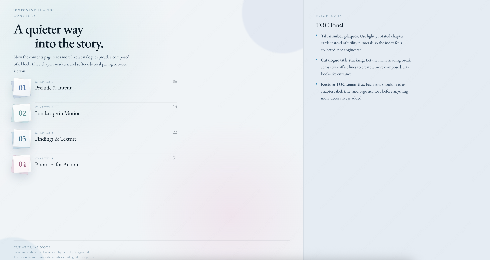
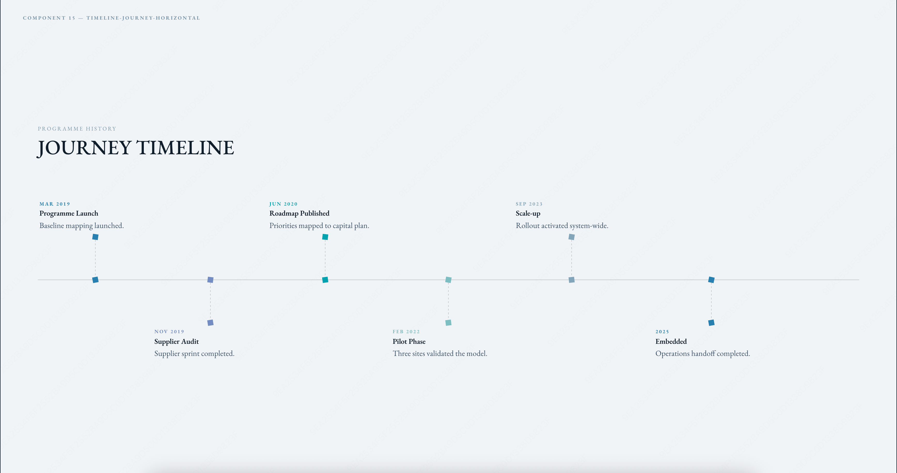

# Revela

**English** | [中文](README.zh-CN.md)

<p align="center">
  
</p>

Revela is an [OpenCode](https://opencode.ai) plugin for turning workspace sources, research, evidence, and user intent into trusted narrative artifacts. Its first render target is HTML slide decks.

## Install

Add Revela to your `opencode.json`:

```json
{
  "$schema": "https://opencode.ai/config.json",
  "plugin": ["@cyber-dash-tech/revela"]
}
```

Restart OpenCode.

To install globally, add the same entry to `~/.config/opencode/opencode.json`.

## Built-In Designs

Revela includes built-in deck designs:

### [summit](designs/summit/preview.html)

<p align="center">
  
  
  
</p>

### [monet](designs/monet/preview.html)

<p align="center">
  
  
  
</p>

`starter` is the clean default presentation style.

Switch designs with:

```text
/revela design --use summit
```

## Domains

Domains add topic-specific narrative guidance, such as consulting, product, or investor communication. Use them when you want Revela to adapt story framing to a specific context.

```text
/revela domain
```

## Quick Start: Make An HTML Deck

1. Initialize the narrative workspace from your local source materials.

```text
/revela init
```

2. Research missing evidence and bind useful findings to claims.

```text
/revela research
```

Skip this step if your local materials already provide enough support.

3. Inspect the claim flow before rendering.

```text
/revela story
```

Use this to check the audience, decision, claims, evidence, gaps, risks, and objections.

4. Generate the HTML deck.

```text
/revela make --deck
```

Revela writes the deck under `decks/` and uses the current narrative, deck plan, and active design.

5. Review or revise the deck.

```text
/revela review --deck
```

See [Review A Deck](#review-a-deck) for Insight and Comment.

6. Export if needed.

```text
/revela export --deck pdf decks/example.html
/revela export --deck pptx decks/example.html
```

## Review A Deck

Use Review after generating an HTML deck:

```text
/revela review --deck
```

Review opens a local deck workspace with two main modes:

- Insight explains selected slide content: what claim it supports, what evidence backs it, what caveats or gaps remain, and why it matters in the narrative.
- Comment lets you request targeted edits on the deck, such as layout, copy, hierarchy, spacing, or visual changes.
