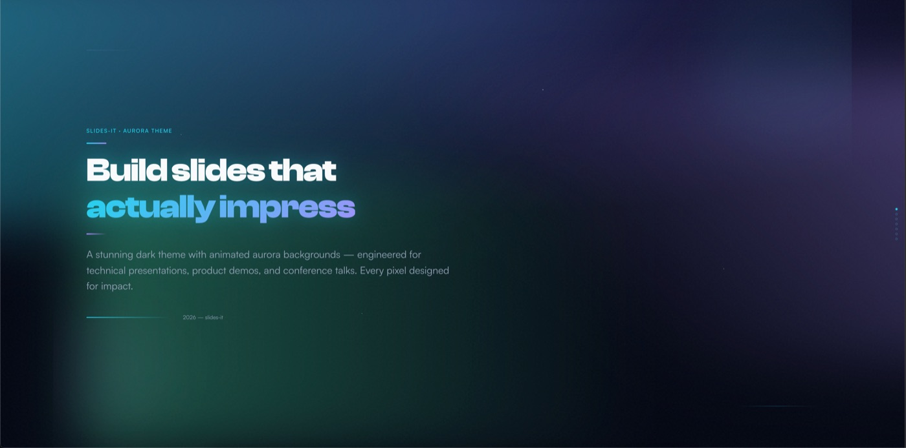
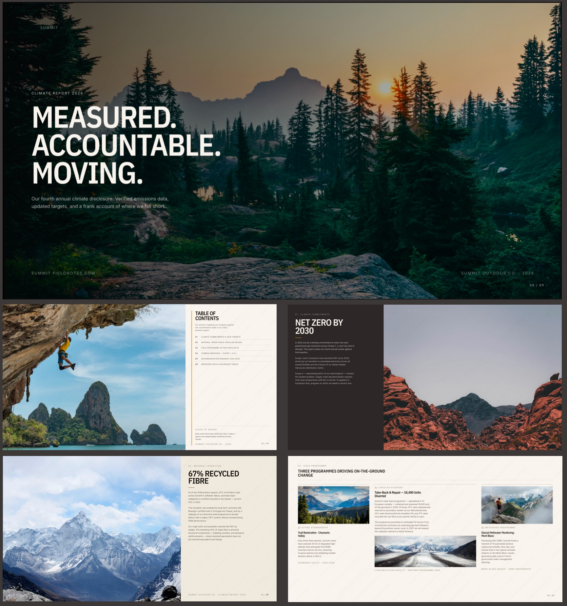

# Revela

**English** | [中文](README.zh-CN.md)

[](https://www.npmjs.com/package/@cyber-dash-tech/revela) [](LICENSE) [](tests/) [](https://opencode.ai)  [](https://bun.sh)

<p align="center">
  
</p>

An [OpenCode](https://opencode.ai) plugin that turns your AI into a presentation assistant.
Tell Revela what's on your mind — it'll finish the research and analysis, and deliver a complete slide deck in a couple of minutes.


**[Live Demo — The AI Power Shift](https://cyber-dash-tech.github.io/revela/assets/html/ai-power-shift.html)** · A 5-slide investment brief generated entirely by Revela.

---

## Requirements

- [OpenCode](https://opencode.ai) — Bun runtime (`bun >= 1.0.0`)
- [Google Chrome](https://www.google.com/chrome/) or Chromium — required for the automatic Layout QA feature
- Git — required for source install

---

## Install

Add `@cyber-dash-tech/revela` to the `plugin` array in your `opencode.json`:

```json
{
  "$schema": "https://opencode.ai/config.json",
  "plugin": ["@cyber-dash-tech/revela"]
}
```

Restart OpenCode — the plugin is downloaded automatically via Bun.

To install globally (available in all projects), add the same `plugin` entry to `~/.config/opencode/opencode.json`.

### From source

```bash
git clone https://github.com/cyber-dash-tech/revela
cd revela && npm install
```

Create `~/.config/opencode/plugins/revela.js`:

```js
export { default } from "/absolute/path/to/revela/index.ts";
```

> **Note (China mainland):** OpenCode's plugin installer uses Bun's package manager, which does not respect npm registry mirror configuration. Use the source install method above, or manually install the package with npm and create a local wrapper — see [中文说明](README.zh-CN.md#安装).

---

## Quick Start

Enable OpenCode's web search (recommended):
```bash
OPENCODE_ENABLE_EXA=1 opencode
```

Enable Revela in your OpenCode session — turns the primary agent into a slide design expert:
```
/revela enable
```

To turn it off and restore the primary agent to normal:
```
/revela disable
```

---

## Commands

```
/revela                          show status (enabled/disabled, active design/domain) + help
/revela enable                   activate slide generation mode for this session
/revela disable                  deactivate

/revela designs                  list installed designs
/revela designs <name>           switch to a design (rebuilds system prompt immediately)
/revela designs-add <source>     install a design from a URL, local path, or github:user/repo

/revela domains                  list installed domains
/revela domains <name>           switch to a domain
/revela domains-add <source>     install a domain from a URL, local path, or github:user/repo
```

All commands execute locally — zero LLM cost, instant feedback.

---

## Built-in Designs

Two designs are bundled. Switch with `/revela designs <name>`.

| Name | Description | Preview |
|---|---|---|
| `aurora` | Dark executive style — deep navy/slate, sharp typography, ECharts data visualization |  |
| `summit` | Editorial outdoor annual-report theme |  |

---

## Built-in Domains

Domains add field-specific report frameworks and terminology to the AI's context.

| Name | Description |
|---|---|
| `general` | No domain specialization (default) |
| `deeptech-investment` | VC/investment analysis — market sizing, technology readiness, investment thesis |
| `consulting` | Strategic consulting — Go/No-Go reports, strategy design, belief-change frameworks |

Switch with `/revela domains <name>`.

---

## Workspace Scan & Research

When Revela is enabled, the AI can:

- **Scan your workspace** (`revela-workspace-scan` tool) — automatically discovers PDF, Word, Excel, PowerPoint, CSV, and Markdown files in your project directory. Reference them with `@filename` to include their content in your slides.
- **Run parallel research** via the `revela-research` subagent — fetches targeted URLs and saves structured findings to `researches/<topic>/`. The primary agent then synthesises these findings into slides.

Supported file types for `@`-reference and automatic text extraction: `.pdf`, `.docx`, `.pptx`, `.xlsx`.

---

## Layout QA

Every time the AI writes a slide file, Revela automatically runs a Puppeteer-based layout check at 1920×1080. If issues are detected, the report is fed back to the AI immediately so it self-corrects — no manual intervention needed.

Checks performed on every slide:

| Check | Description |
|---|---|
| **Fill ratio** | Content must occupy enough of the canvas |
| **Bottom whitespace** | Flags large empty gaps at the slide bottom |
| **Overflow** | Elements that extend outside the canvas |
| **Asymmetry** | Side-by-side columns with large height differences |
| **Density imbalance** | Columns where CSS `align-items: stretch` hides content imbalance |
| **Sparse** | Slides with too few visible elements |

Structural slides (cover, TOC, quote, summary, closing) set `slide-qa="false"` and are automatically exempted from fill/spacing checks. Content-heavy slides set `slide-qa="true"` to opt in.

You can also invoke QA manually: ask the AI to "run QA on slides/my-deck.html" or use the `revela-qa` tool directly.

Requires Google Chrome or Chromium to be installed on your system.

---

## Custom Designs

A design is a folder with a `DESIGN.md` file. Frontmatter declares metadata:

```yaml
---
name: my-design
description: Short description shown in /revela designs
author: you
version: 1.0.0
---
```

The body provides visual style instructions injected into the AI's system prompt.

### On-demand marker system (recommended for larger designs)

Use HTML comment markers to split the design into sections. Only `global` and `layouts` are injected every turn; everything else is fetched on demand by the AI — keeping per-turn token cost low.

```html
<!-- @section:global:start -->
Color palette, typography, base CSS variables, JavaScript SlidePresentation class, HTML document structure...
<!-- @section:global:end -->

<!-- @section:layouts:start -->
Layout primitives used on every slide (two-column, card grid, etc.)...
<!-- @section:layouts:end -->

<!-- @section:components:start -->
<!-- @component:card:start -->
Card component HTML + CSS...
<!-- @component:card:end -->

<!-- @component:stat-card:start -->
Stat card HTML + CSS...
<!-- @component:stat-card:end -->
<!-- @section:components:end -->

<!-- @section:charts:start -->
ECharts / data visualization specifications...
<!-- @section:charts:end -->

<!-- @section:guide:start -->
Composition rules, common recipes, do/don't examples...
<!-- @section:guide:end -->
```

**Injected every turn:** `global`, `layouts`, and a compact Component Index table.

**Fetched on demand** by the AI: individual components, `charts`, `guide`.

Without markers, the entire `DESIGN.md` body is injected every turn (backward-compatible).

### Install a custom design

```
/revela designs-add github:your-org/your-design
/revela designs-add https://example.com/my-design.zip
/revela designs-add ./path/to/local/design-folder
```

---

## Custom Domains

A domain adds domain-specific report frameworks, terminology, and structural guidance.

Domain folder structure: `<name>/INDUSTRY.md` with the same frontmatter format as designs.

```
/revela domains-add github:your-org/your-domain
```

---

## Logging

Revela uses structured JSON logging via [tslog](https://tslog.js.org/).
Logs are written to `stderr`. To enable verbose debug output:

```bash
REVELA_DEBUG=1 opencode
```

---

## License

MIT — see [LICENSE](LICENSE).
