# Revela

**English** | [中文](README.zh-CN.md)

[](https://www.npmjs.com/package/@cyber-dash-tech/revela) [](LICENSE) [](tests/) [](https://github.com/openai/codex) [](https://bun.sh)

<p align="center">
  
</p>

Revela is a Codex plugin for turning source materials, research, data, and intent into trusted, traceable, presentation-ready decision artifacts.

In your local workspace, Revela reviews materials, saves source-linked research, builds an explicit `deck-plan.md`, generates HTML decks, surfaces them as localhost Codex Browser website cards for annotation, and exports PDF/PPTX/PNG artifacts.

## Install

### Codex

Requirements:

- The Codex CLI must be installed and the `codex` command must be available in your shell.
- Your environment must be able to run `bun`; Revela uses `bun ./mcp/revela-server.ts` from the installed Codex plugin cache to start the MCP server.

Optional preflight:

```bash
codex --version
codex exec --help
bun --version
```

If npm package checks fail with an npm cache permission error, repair the cache ownership or use a writable cache for local checks:

```bash
sudo chown -R "$(id -u):$(id -g)" ~/.npm
npm_config_cache=/tmp/revela-npm-cache bun run smoke:mcp-pack
```

Install Revela through the Codex Git marketplace:

```bash
codex plugin marketplace add https://github.com/cyber-dash-tech/revela --ref v0.19.6
codex plugin add revela@revela
```

The Git marketplace install provides the Codex plugin shell, skills, hooks, and MCP configuration. When Codex starts the Revela MCP server, it runs `bun ./mcp/revela-server.ts` from the installed plugin cache and resolves the checked-out marketplace runtime.

You do not need to run `bun install` inside the Codex marketplace clone.

Start a new Codex thread after installing so Codex loads the Revela skills, MCP tools, and hooks.

Codex uses eight Revela skills: `revela` for routing the next workflow step, `revela-spec` for writing root-level `spec.md`, `revela-helper` for status and active design/domain, `revela-design` for custom design creation/validation/activation, `revela-domain` for custom narrative domain creation/validation/activation, `revela-research` for local and web research saved under `researches/` plus the design-aware `deck-plan.md` handoff, `revela-make-deck` for generating HTML deck artifacts from an existing plan and surfacing the QA-passed deck as a localhost Codex Browser website card, and `revela-export` for PDF/PPTX/PNG.

For release-aligned local validation, run `bun run smoke:mcp-pack`. It packs the current checkout to a temporary npm tarball, extracts it, and starts the MCP server through the packaged Codex plugin launcher path without requiring a registry publish.

#### Codex Upgrade

In Codex, ask Revela to check the current runtime version; the plugin calls `revela_doctor` and reports the running `version`.

For a fixed release tag, reinstall the plugin from that tag:

```bash
codex plugin remove revela@revela
codex plugin marketplace remove revela
codex plugin marketplace add https://github.com/cyber-dash-tech/revela --ref vX.Y.Z
codex plugin add revela@revela
```

For a marketplace entry that intentionally tracks a branch or movable ref, upgrade the marketplace clone and re-add the plugin:

```bash
codex plugin marketplace upgrade revela
codex plugin add revela@revela
```

The Git marketplace ref and `.mcp.json` plugin launcher are part of the same release artifact. Start a new Codex thread after upgrading so Codex reloads the Revela skills, MCP tools, hooks, and runtime launcher.

## Built-In Designs

Revela includes built-in deck designs. Design previews are generated from the built-in page-template preview fixture plus the selected design CSS. Each row shows a cover plus representative template pages chosen to highlight that design's character.

### starter

<p align="center">
  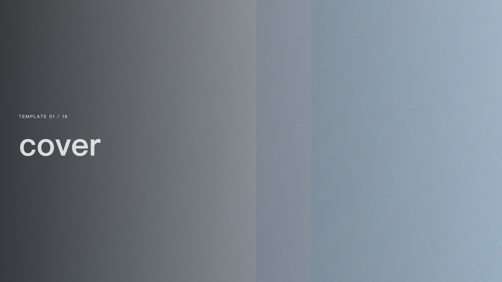
  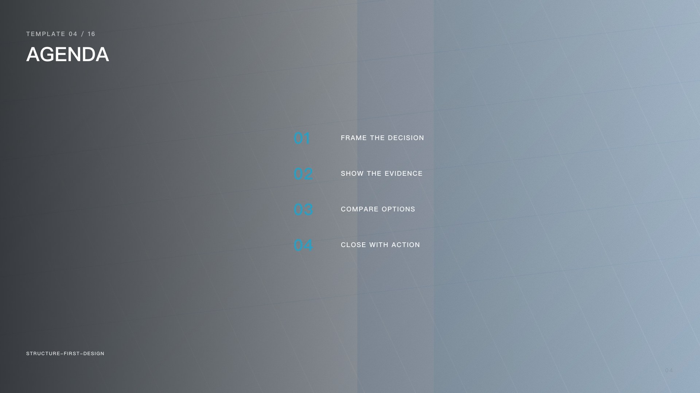
  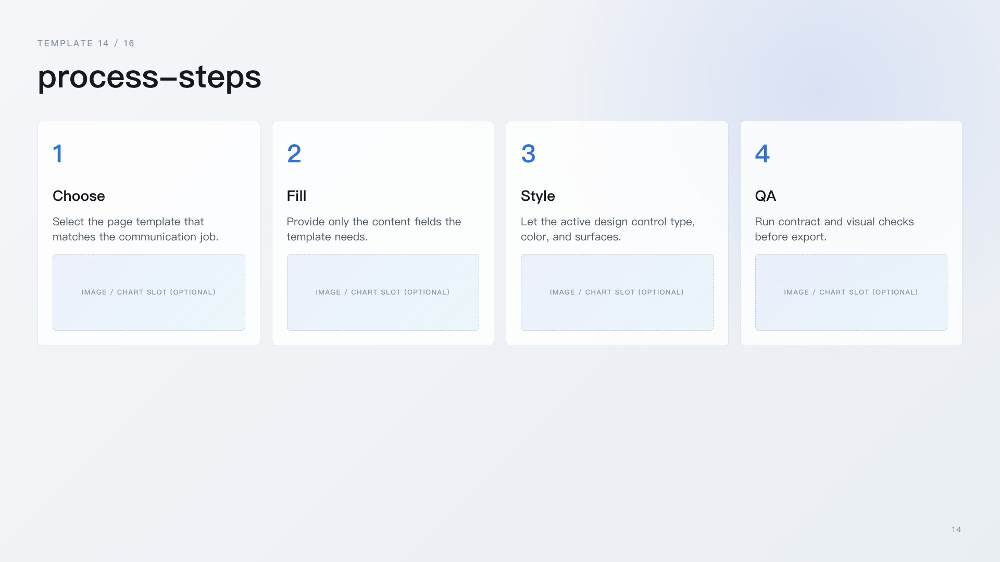
</p>

### summit

<p align="center">
  
  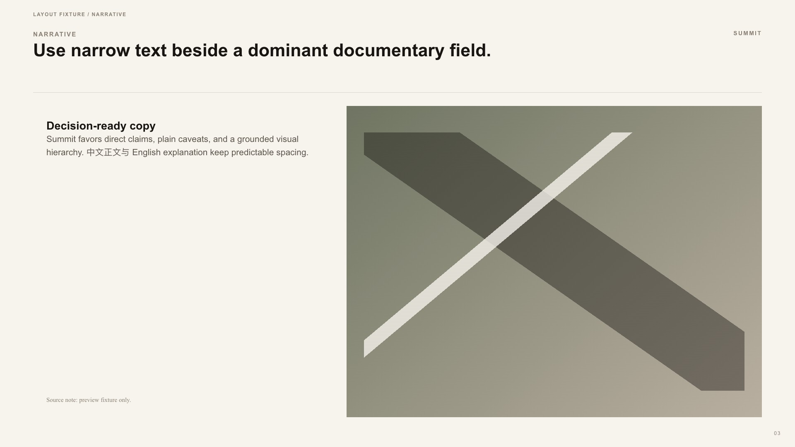
  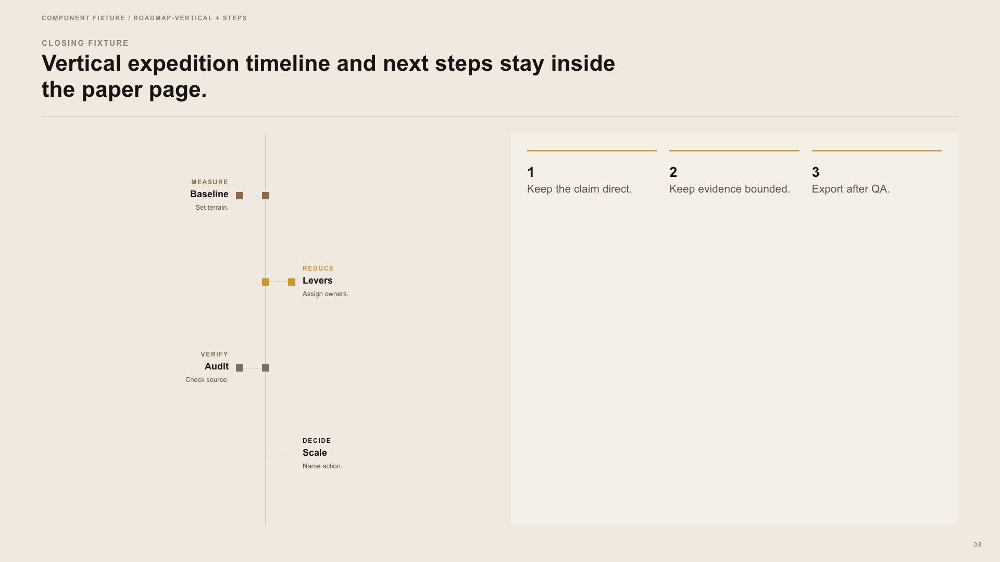
</p>

### monet

<p align="center">
  
  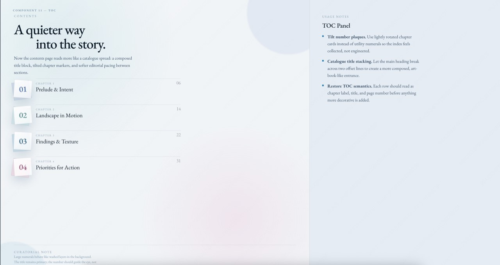
  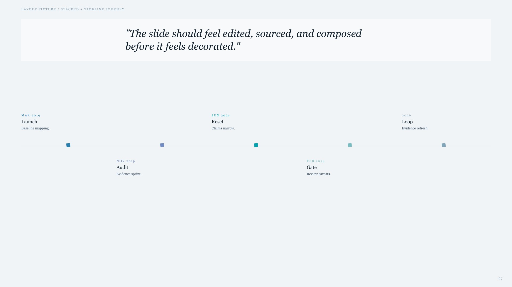
</p>

### lucent

<p align="center">
  
  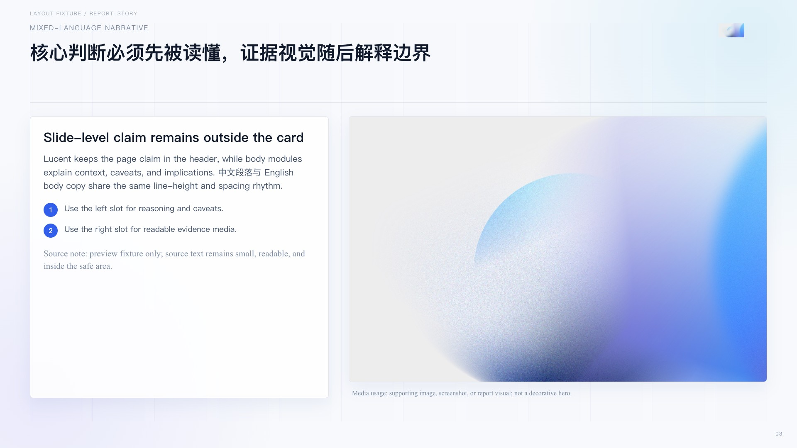
  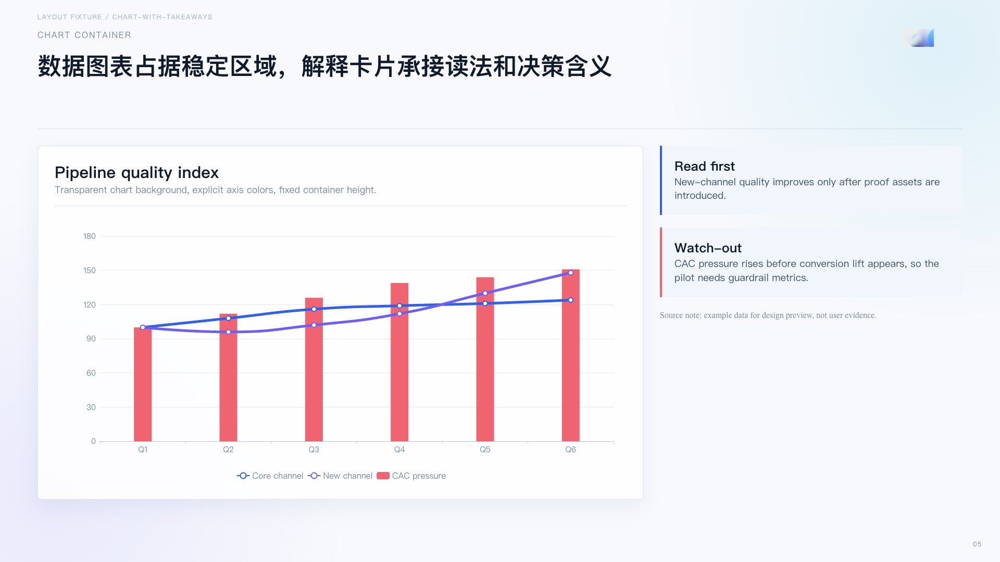
</p>

### lucent-dark

<p align="center">
  
  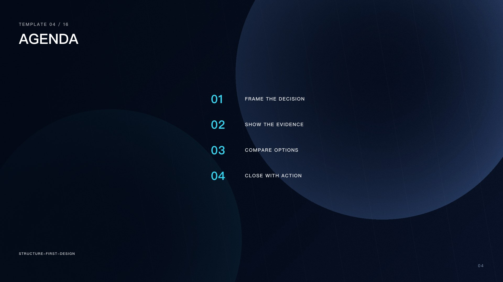
  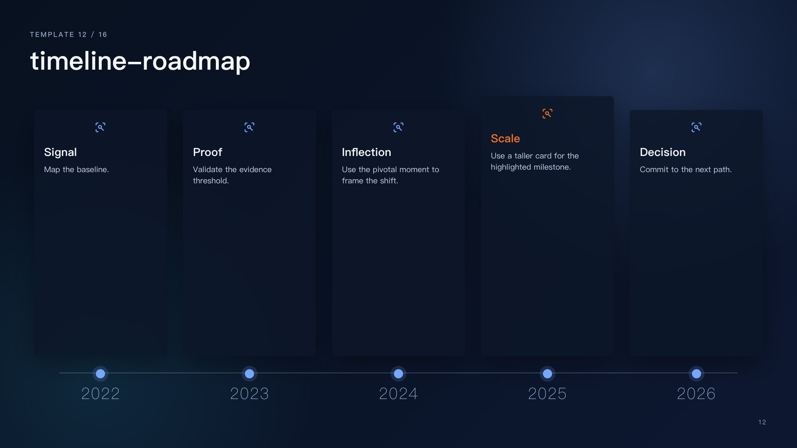
</p>

To switch designs in Codex, ask:

> [$revela:revela](/Users/mengdigao/.codex/plugins/cache/revela/revela/0.19.6/skills/revela/SKILL.md), use summit as the design.

In Codex, ask Revela to list or switch designs; the plugin uses the active design when making decks.

## Domains

Domains add topic-specific communication guidance, such as consulting, product, or investor communication. Use them when you want Revela to adapt deck framing to a specific context.

> [$revela:revela](/Users/mengdigao/.codex/plugins/cache/revela/revela/0.19.6/skills/revela/SKILL.md), list available domains.

In Codex, ask Revela to list or switch domains; the active domain guides deck framing during init, research, and planning.

## Quick Start

Use these prompts in Codex from the workspace that contains your source materials.

1. Choose the narrative domain before authoring so Revela frames the audience, decision, risks, and objections for your context.

> [$revela:revela](/Users/mengdigao/.codex/plugins/cache/revela/revela/0.19.6/skills/revela/SKILL.md), use consulting as the domain.

2. Choose the deck design before rendering so generated artifacts use the intended visual language.

> [$revela:revela](/Users/mengdigao/.codex/plugins/cache/revela/revela/0.19.6/skills/revela/SKILL.md), use summit as the design.

3. Create a custom design when you want a different visual direction.

> [$revela:revela](/Users/mengdigao/.codex/plugins/cache/revela/revela/0.19.6/skills/revela/SKILL.md), create a new design named neon-finance with a crisp financial-dashboard style: dark surfaces, precise grids, and bright green accents.

Revela may ask for references or constraints, then creates a workspace draft with `DESIGN.md`, `design.css`, and any local `assets/**`. It generates a preview from the built-in page-template fixture plus that CSS so you can review cover, agenda, timelines, charts, tables, cards, and visual slots before installing. When it is ready, switch to it:

> [$revela:revela](/Users/mengdigao/.codex/plugins/cache/revela/revela/0.19.6/skills/revela/SKILL.md), use neon-finance as the design.

4. Initialize local material intake. Init scans, extracts, and reviews workspace sources; it does not create a Narrative Vault.

> [$revela:revela](/Users/mengdigao/.codex/plugins/cache/revela/revela/0.19.6/skills/revela/SKILL.md), help me init this workspace from the local materials.

5. Research source-linked deck inputs and save findings.

> [$revela:revela](/Users/mengdigao/.codex/plugins/cache/revela/revela/0.19.6/skills/revela/SKILL.md), research the public evidence and examples needed for this deck.

6. Create or update the deck plan before generating HTML so slide order, chapter structure, source links, unresolved inputs, source limitations, and visual intent are explicit.

> [$revela:revela](/Users/mengdigao/.codex/plugins/cache/revela/revela/0.19.6/skills/revela/SKILL.md), create or update the deck plan before generating HTML.

7. Make an HTML deck from the current deck plan.

> [$revela:revela](/Users/mengdigao/.codex/plugins/cache/revela/revela/0.19.6/skills/revela/SKILL.md), make the deck from the current deck plan.

8. Review and annotate the generated deck from the localhost website card after make-deck completes.

Revela serves the deck from `http://127.0.0.1:<port>/decks/<file>.html` so you can click the card and open it in Codex Browser. Use Codex Browser's native annotation tools on the opened HTML deck.

9. Export a PDF after deck QA passes.

> [$revela:revela](/Users/mengdigao/.codex/plugins/cache/revela/revela/0.19.6/skills/revela/SKILL.md), export the deck to PDF.

10. Export an editable PPTX after deck QA passes.

> [$revela:revela](/Users/mengdigao/.codex/plugins/cache/revela/revela/0.19.6/skills/revela/SKILL.md), export the deck to PPTX.

11. Export per-slide PNG files after deck QA passes.

> [$revela:revela](/Users/mengdigao/.codex/plugins/cache/revela/revela/0.19.6/skills/revela/SKILL.md), export the deck to PNG.

## Annotate A Deck

After `revela-make-deck` generates an HTML deck and Artifact QA passes, Codex replies with a localhost website card that you can click to open the deck in Codex Browser. Use the browser's native annotation tools for targeted edits such as layout, copy, hierarchy, spacing, or visual changes.
